# Phase 1 dan 2: Requirement Discovery dan System Design

## PHASE 1: REQUIREMENT DISCOVERY

### 1. Product Summary

Platform ini mengelola order legalitas pendirian PT dan CV. Alurnya dimulai dari pembayaran dan berakhir pada penyerahan dokumen final ke Client. Platform menggantikan spreadsheet, grup WhatsApp, dan follow-up manual. Penggantinya adalah workflow berbasis event, SLA clock, reminder otomatis, eskalasi bertingkat, dan audit trail.

### 2. Core Problem

| # | Masalah | Dampak |
|---|---|---|
| P1 | Status proyek tersebar di spreadsheet dan chat | Tidak ada satu sumber status yang dapat dipercaya |
| P2 | Admin mengecek dokumen satu per satu | Waktu Admin habis untuk pekerjaan administratif |
| P3 | Keterlambatan baru terlihat setelah terjadi | SLA terlanggar tanpa peringatan |
| P4 | Client dan Notaris berada dalam grup WhatsApp yang sama | Data pribadi terekspos ke pihak yang tidak perlu |
| P5 | Dokumen berpindah tanpa versi dan kontrol akses | Risiko salah dokumen dan kebocoran data |
| P6 | Status diubah manual oleh Admin | Status tidak akurat dan tidak dapat diaudit |

### 3. Proposed Solution

Platform memakai modular monolith dengan tujuh komponen inti:

1. Workflow engine berbasis template berversi (PT dan CV terpisah).
2. Task engine event-driven dengan auto-completion berbasis bukti terverifikasi.
3. Document pipeline: validasi, malware scan, klasifikasi, verifikasi, versioning.
4. WhatsApp proxy: platform menjadi perantara Client dan Notaris.
5. SLA engine dengan business calendar dan pause state.
6. Rules engine untuk reminder dan eskalasi.
7. Dashboard per role dan audit log append-only.

### 4. Actors

| Actor | Tipe | Tanggung jawab utama |
|---|---|---|
| Super Admin | Internal | Monitoring, konfigurasi, override, eskalasi L3 |
| Admin | Internal | Koordinasi, follow-up, review dokumen berkonfidensi rendah |
| Client | Eksternal | Order, bayar, isi data, upload, review draft, terima dokumen |
| Notary | Eksternal partner | Proses draft, akta, pendaftaran, upload dokumen |
| System | Otomatis | Scheduler, worker, rules engine |
| Payment Gateway | Integrasi | Proses pembayaran dan webhook |
| WhatsApp Provider | Integrasi | Kirim dan terima pesan |
| Email Provider | Integrasi | Notifikasi email |
| Object Storage | Integrasi | Penyimpanan file privat |
| Malware Scanner | Integrasi | Pemindaian file |
| AI/OCR Provider | Integrasi opsional | Klasifikasi dan ekstraksi |

### 5. Core Workflow

```mermaid
flowchart LR
  A[Order] --> B[Payment PAID]
  B --> C[Project dibuat]
  C --> D[Data Submission]
  D --> E[Data Validation]
  E --> F[Notary Acceptance]
  F --> G[Draft Deed]
  G --> H[Client Draft Review]
  H -- revisi --> G
  H --> I[Signing]
  I --> J[Deed Finalization]
  J --> K[Registration]
  K --> L[Final QA]
  L --> M[Delivery]
  M --> N[DELIVERED]
```

### 6. Major Modules

| Modul | Tanggung jawab | Dokumen |
|---|---|---|
| Identity and Access | Auth, session, MFA, RBAC | AUTHORIZATION.md, SECURITY.md |
| Catalog and Order | Service, harga, order | PAYMENT_SYSTEM.md |
| Payment | Gateway, webhook, rekonsiliasi | PAYMENT_SYSTEM.md |
| Project | Lifecycle, assignment, workspace | WORKFLOW.md, STATE_MACHINE.md |
| Workflow and Task | Template, instansiasi, dependency, to-do | WORKFLOW.md |
| Document | Pipeline, versi, storage | DOCUMENT_MANAGEMENT.md |
| Messaging | Conversation, internal note, WhatsApp proxy | WHATSAPP_INTEGRATION.md |
| Notification | Multi-channel dispatch | NOTIFICATION_SYSTEM.md |
| SLA and Escalation | Clock, health, eskalasi | SLA_ENGINE.md, ESCALATION_ENGINE.md |
| Risk | Operational Risk Score | RISK_ENGINE.md |
| Audit | Log append-only | AUDIT_LOG.md |
| Analytics | Agregasi metrik | ANALYTICS.md |
| AI Helper | Klasifikasi, OCR, intent | AI_FEATURES.md |

### 7. Critical Business Rules

Detail lengkap ada di `BUSINESS_RULES.md`.

| ID | Aturan |
|---|---|
| BR-PAY-001 | Status pembayaran hanya berubah dari webhook terverifikasi atau server-side query. |
| BR-PROJECT-001 | Project dibuat tepat satu kali saat pembayaran berstatus PAID. |
| BR-DOC-001 | File terunggah tidak sama dengan task selesai. Task selesai jika dokumen VERIFIED. |
| BR-DOC-003 | Dokumen legal-critical wajib melewati gerbang manusia sebelum delivery. |
| BR-SLA-002 | Waktu menunggu Client tidak dihitung dalam SLA internal. |
| BR-SLA-001 | SLA dihitung dalam business time, bukan waktu kalender. |
| BR-WA-001 | Client dan Notaris tidak pernah melihat nomor telepon satu sama lain. |
| BR-WA-003 | Lampiran WhatsApp masuk document pipeline. Platform tidak meneruskan file mentah. |
| BR-AUTH-002 | Notaris hanya melihat project yang di-assign. |
| BR-AI-001 | AI tidak mengambil keputusan legal. |
| BR-AUDIT-001 | Audit log bersifat append-only. |

### 8. Major Risks

| ID | Kategori | Risiko | Mitigasi |
|---|---|---|---|
| R-01 | Bisnis | Target 5 hari tidak realistis karena proses eksternal (tanda tangan, sistem pemerintah) | Pause reason EXTERNAL_DEPENDENCY, target configurable |
| R-02 | Bisnis | Notaris sebagai mitra eksternal menolak memakai platform | UX Notaris minimal, WhatsApp sebagai kanal utama |
| R-03 | Teknis | Resolusi project dari pesan WhatsApp salah | Algoritma resolusi bertingkat dan fallback NEEDS_REVIEW |
| R-04 | Teknis | Kebijakan WhatsApp Business Platform membatasi pesan inisiatif bisnis | Template message terdaftar, validasi provider |
| R-05 | Teknis | Webhook ganda atau tidak berurutan | Inbox table, unique event ID, state guard |
| R-06 | Keamanan | Kebocoran KTP dan dokumen legal | Private bucket, signed URL, enkripsi, audit download |
| R-07 | Legal | Kewajiban UU PDP belum dipetakan penuh | LEGAL_REVIEW_REQUIRED, privacy by default |
| R-08 | Legal | Kewajiban kerahasiaan Notaris atas akta | Scope akses minimal, review hukum |
| R-09 | Operasional | Klasifikasi AI keliru dan menyelesaikan task | Threshold, gerbang manusia, audit |
| R-10 | Operasional | Notifikasi berlebihan membuat user abai | Dedup, quiet hours, digest |

### 9. Ambiguities dan Contradictions

| ID | Temuan | Resolusi |
|---|---|---|
| K-01 | "1 hari per tahap" bertentangan dengan "maksimal 5 hari total". Workflow PT punya 10 sampai 12 tahap. | SLA tahap berlaku untuk task internal. Project clock menghitung waktu proses internal saja. Waktu Client dan dependensi eksternal di-pause. |
| K-02 | Project dibuat saat order atau saat pembayaran tidak jelas. Daftar status memuat ORDER_CREATED dan PAYMENT_PENDING, tetapi automation matrix menulis "Payment Confirmed -> Create Project". | Order dan Project dipisah. Order punya status pembayaran sendiri. Project dibuat saat PAID. |
| K-03 | Daftar status project mencampur lifecycle (IN_PROGRESS), kondisi menunggu (WAITING_CLIENT), dan flag (ESCALATED). | Lifecycle menjadi `project.status`. Pihak yang ditunggu menjadi `project.blocked_on`. Eskalasi menjadi flag `is_escalated`. Warna menjadi `health`. |
| K-04 | Reminder memakai "Project Day", SLA task memakai durasi per task. | Dua clock resmi: Task Clock dan Project Clock. Keduanya didefinisikan di SLA_ENGINE.md. |
| K-05 | "Notaris dapat mengubah progress" bertentangan dengan prinsip Automation First. | Notaris tidak mengubah status secara bebas. Progress berubah dari event (upload, accept, konfirmasi signing). |
| K-06 | Permission "Limited" untuk Admin tidak didefinisikan. | Limited berarti project tempat Admin menjadi primary atau secondary admin. |
| K-07 | Satu nomor WhatsApp platform melayani banyak project per Notaris. Konteks project ambigu. | Algoritma resolusi 4 langkah di WHATSAPP_INTEGRATION.md. |
| K-08 | Delivery via WhatsApp bertentangan dengan Privacy by Default jika file dikirim mentah. | Default mengirim secure link ke portal. Lampiran langsung menjadi opsi `REQUIRES BUSINESS DECISION`. |
| K-09 | Notaris "View payment: Limited" tidak jelas manfaatnya. | Notaris hanya melihat flag lunas. Nominal tidak terlihat. |
| K-10 | Workflow tidak memuat tahap penandatanganan akta. Akta notaris umumnya membutuhkan kehadiran penghadap. | Tahap SIGNING ditambahkan dengan jadwal dan bukti. `LEGAL_REVIEW_REQUIRED` untuk mekanisme tanda tangan. |
| K-11 | Isi "dokumen final" per layanan tidak didefinisikan. | Deliverable dikonfigurasi per service package. |
| K-12 | "1 atau lebih Admin" tanpa penanggung jawab tunggal. | Satu primary admin (accountable) dan nol atau lebih secondary admin. |

### 10. Missing Requirements yang Ditambahkan

| Requirement | Alasan |
|---|---|
| Tahap SIGNING dan jadwal tanda tangan | Proses akta membutuhkan tanda tangan |
| Loop revisi draft | Client dapat meminta perubahan draft |
| Notary accept dan decline | Notaris eksternal dapat menolak penugasan |
| Kebijakan pembatalan dan refund | Payment status memuat REFUNDED |
| Consent capture | Platform memproses data pribadi |
| Invoice dan receipt | Bukti transaksi untuk Client |
| Kalender libur nasional | SLA memakai business calendar |
| Multi-founder data | PT dan CV melibatkan lebih dari satu pendiri |
| Data subject request | Hak subjek data |

### 11. Assumptions

Daftar lengkap ada di `ASSUMPTIONS.md`. Asumsi berdampak terbesar:

- A-001: Satu organisasi penyedia jasa (single-tenant). Multi-tenant masuk roadmap.
- A-002: Pembayaran penuh di muka.
- A-003: Notaris adalah mitra eksternal dengan akun platform.
- A-005: Zona waktu bisnis Asia/Jakarta.
- A-007: Project Clock mulai saat Data Validation disetujui.

### Pertanyaan Blocking

Tidak ada pertanyaan yang benar-benar blocking. Semua celah dicatat sebagai ASSUMPTION atau OPEN QUESTION dan development dapat dimulai.

---

## PHASE 2: SYSTEM AND PRODUCT DESIGN

Detail arsitektur ada di `SYSTEM_ARCHITECTURE.md`. Ringkasan keputusan:

| ADR | Keputusan | Alasan |
|---|---|---|
| ADR-001 | Modular monolith, bukan microservices | Tim kecil, domain belum stabil, biaya operasional rendah |
| ADR-002 | TypeScript end-to-end (Next.js, NestJS, worker) | Tipe bersama antara frontend, backend, dan AI coding agent |
| ADR-003 | PostgreSQL sebagai single source of truth | Transaksi ACID, constraint, JSONB untuk form dinamis |
| ADR-004 | Redis dan BullMQ untuk queue | Cukup untuk volume MVP, retry dan delay bawaan |
| ADR-005 | Transactional outbox untuk event | Menjamin event tidak hilang saat transaksi commit |
| ADR-006 | Inbox table untuk semua webhook | Idempotency dan replay |
| ADR-007 | Object storage S3-compatible, bucket privat | Provider agnostic, signed URL |
| ADR-008 | Provider interface untuk payment, WhatsApp, email, storage, AI | Mencegah vendor lock-in |
| ADR-009 | Workflow template berversi dalam database | Configurable tanpa deploy |
| ADR-010 | Hosting di region Jakarta | Latensi rendah dan mitigasi risiko lokasi data (LEGAL_REVIEW_REQUIRED) |
