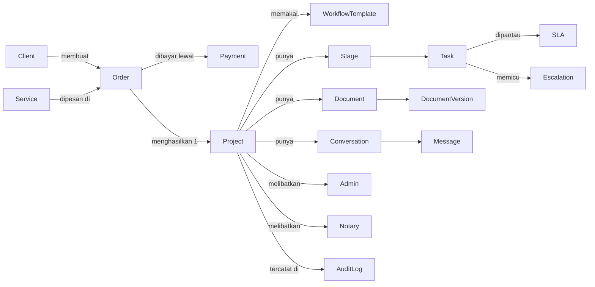
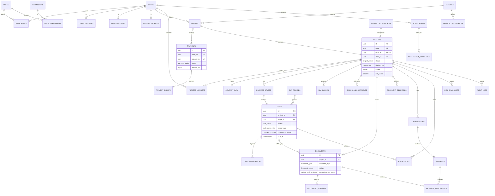

# ERD

## 1. Conceptual ERD

## 2. Logical ERD

## 3. Kardinalitas Kritis

| Relasi | Kardinalitas | Penegak |
|---|---|---|
| Order ke Project | 1 : 0..1 | `projects.order_id unique` |
| Project ke primary admin aktif | 1 : 1 | Partial unique index |
| Project ke Notary aktif | 1 : 0..1 | Partial unique index |
| Order ke payment aktif | 1 : 0..1 | Partial unique index |
| Task ke eskalasi terbuka per level | 1 : 0..1 | Partial unique index |
| Document ke versi | 1 : 1..n | `unique (document_id, version_no)` |
