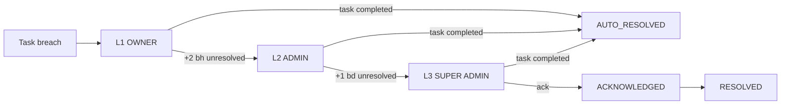

# Escalation Engine

## 1. Level

| Level | Penerima | Tujuan |
|---|---|---|
| L1_OWNER | Owner task | Owner tahu task terlambat |
| L2_ADMIN | Primary admin project | Admin turun tangan |
| L3_SUPER_ADMIN | Semua Super Admin aktif | Keputusan management |

## 2. Aturan Pemicu

| ID | Kondisi | Level | Timing default |
|---|---|---|---|
| ESC-R01 | Task NOTARY breach | L1_OWNER | Saat breach |
| ESC-R02 | Task NOTARY masih breach | L2_ADMIN | Breach + 2 business hours |
| ESC-R03 | Task NOTARY masih breach | L3_SUPER_ADMIN | Breach + 1 business day |
| ESC-R04 | Task ADMIN breach | L1_OWNER | Saat breach |
| ESC-R05 | Task ADMIN masih breach | L3_SUPER_ADMIN | Breach + 4 business hours |
| ESC-R06 | Project health CRITICAL (Day 5) | L2_ADMIN | Saat masuk CRITICAL |
| ESC-R07 | Project `sla_breached` | L3_SUPER_ADMIN | Saat breach |
| ESC-R08 | Notary decline atau timeout 2 kali pada project yang sama | L3_SUPER_ADMIN | Segera |
| ESC-R09 | Delivery FAILED di semua channel | L2_ADMIN | Segera |
| ESC-R10 | Manual oleh Admin | L2 atau L3 | Segera, alasan wajib |
| ESC-R11 | Eskalasi L3 tidak di-acknowledge | L3 (re-notify) | 4 business hours |

Task Client tidak masuk aturan ini (BR-SLA-004). Task ADMIN melompati L2 karena owner adalah Admin itu sendiri.

Aturan disimpan di tabel `escalation_rules` (JSON condition, level, delay, active). Timing dapat diubah Super Admin.

## 3. Record Eskalasi

| Field | Keterangan |
|---|---|
| `id`, `project_id`, `task_id` (nullable) | Referensi |
| `rule_code` | Contoh ESC-R02 |
| `level` | L1_OWNER, L2_ADMIN, L3_SUPER_ADMIN |
| `reason` | Teks yang dihasilkan sistem atau Admin |
| `recipient_user_ids` | Array penerima |
| `status` | OPEN, ACKNOWLEDGED, RESOLVED, AUTO_RESOLVED |
| `triggered_at`, `acknowledged_at`, `acknowledged_by` | Timestamp |
| `resolved_at`, `resolved_by`, `resolution_note` | Timestamp dan catatan |

Unique partial index: `(task_id, level) WHERE status IN ('OPEN','ACKNOWLEDGED')` (BR-ESC-001). Untuk eskalasi level project: `(project_id, rule_code) WHERE task_id IS NULL AND status IN (...)`.

## 4. Lifecycle

- Task COMPLETED menutup semua eskalasi terbuka milik task itu sebagai AUTO_RESOLVED.
- Project COMPLETED, CANCELLED, atau ON_HOLD menutup eskalasi level project sebagai AUTO_RESOLVED.
- `project.is_escalated = true` selama ada eskalasi L2 atau L3 terbuka.

## 5. Anti-Noise

- Satu eskalasi per task per level.
- Notifikasi eskalasi yang sama tidak dikirim ulang lebih dari satu kali per 4 business hours.
- Eskalasi di luar jam kerja dikirim in-app segera, WhatsApp pada awal jam kerja berikutnya, kecuali L3 (`REQUIRES BUSINESS DECISION`: apakah L3 boleh dikirim di luar jam kerja).
