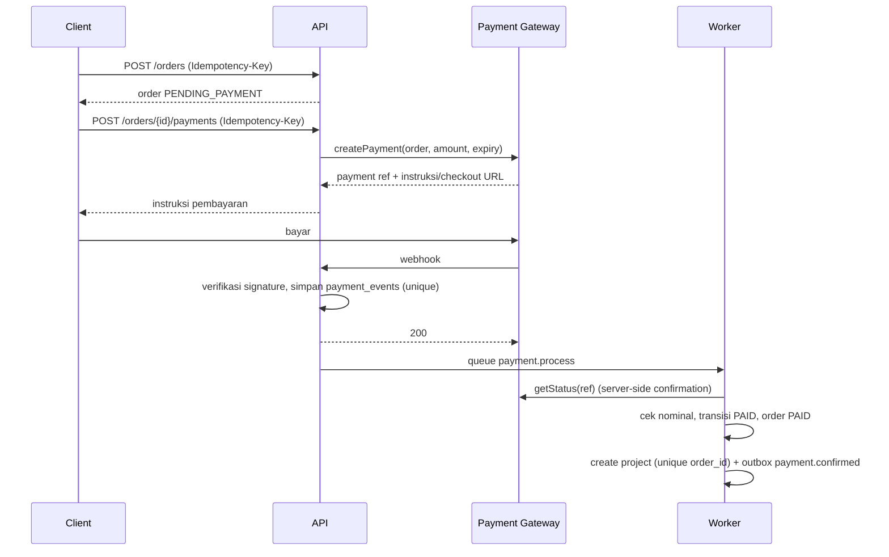

# Payment System

## 1. Scope

- Pembayaran penuh di muka (A-002).
- Mata uang IDR. Nominal disimpan sebagai integer rupiah.
- Gateway di balik interface `PaymentProvider`. Pilihan gateway (contoh gateway lokal yang mendukung virtual account, QRIS, e-wallet) adalah `REQUIRES BUSINESS DECISION` dan `TECHNICAL_VALIDATION_REQUIRED`.

## 2. Flow



Redirect "sukses" dari gateway hanya menampilkan halaman "menunggu konfirmasi". Halaman polling `GET /payments/{id}` setiap 5 detik sampai 2 menit.

## 3. Provider Interface

```ts
interface PaymentProvider {
  createPayment(input: { orderId: string; amount: number; currency: 'IDR';
    customer: { name: string; email: string; phone: string };
    expiresAt: Date; idempotencyKey: string }): Promise<{ providerRef: string; checkoutUrl?: string; instructions?: unknown }>;
  getStatus(providerRef: string): Promise<{ status: PaymentStatus; amount: number; paidAt?: Date; raw: unknown }>;
  verifyWebhook(headers: Record<string, string>, rawBody: Buffer): boolean;
  parseWebhook(rawBody: Buffer): { providerEventId: string; providerRef: string; status: PaymentStatus; amount: number; occurredAt: Date };
  cancel(providerRef: string): Promise<void>;
}
```

## 4. Aturan Keamanan

| Ancaman | Kontrol |
|---|---|
| Status dipalsukan dari frontend | Frontend tidak punya endpoint untuk set status (BR-PAY-001) |
| Webhook palsu | Verifikasi signature dan konfirmasi ulang lewat `getStatus` |
| Webhook ganda | Unique `(provider, provider_event_id)` di `payment_events` |
| Webhook tidak berurutan | Guard urutan status (STATE_MACHINE.md bagian 2) |
| Nominal berbeda | Tolak transisi, alert Super Admin (BR-PAY-002) |
| Project ganda | Unique `projects.order_id` dan transaksi tunggal |
| Order dibayar dua kali | Satu payment aktif per order. Pembayaran kedua yang tetap masuk menjadi kasus refund (EC-01). |

## 5. Rekonsiliasi

| Job | Frekuensi | Aksi |
|---|---|---|
| `payment.reconcile.pending` | 15 menit | `getStatus` untuk payment PENDING atau PROCESSING berumur lebih dari 10 menit |
| `payment.reconcile.daily` | Harian 02:00 WIB | Bandingkan payment PAID dengan laporan settlement gateway (TECHNICAL_VALIDATION_REQUIRED) |
| `order.expire` | 5 menit | Order lewat `expires_at` menjadi EXPIRED |

## 6. Refund

MVP: refund dieksekusi manual di dashboard gateway. Super Admin mencatat refund di platform dengan nominal, alasan, dan referensi. Sistem mengubah payment dan order menjadi REFUNDED dan project menjadi CANCELLED jika belum DELIVERED.

`REQUIRES BUSINESS DECISION`: kebijakan refund per stage (contoh: refund penuh sebelum Notary menerima, refund parsial setelahnya).

## 7. Invoice

- Nomor `INV-YYYY-NNNNNN`.
- PDF invoice dibuat saat order dibuat. Receipt dibuat saat PAID.
- `REQUIRES BUSINESS DECISION` dan review pajak: kewajiban PPN dan format faktur.
