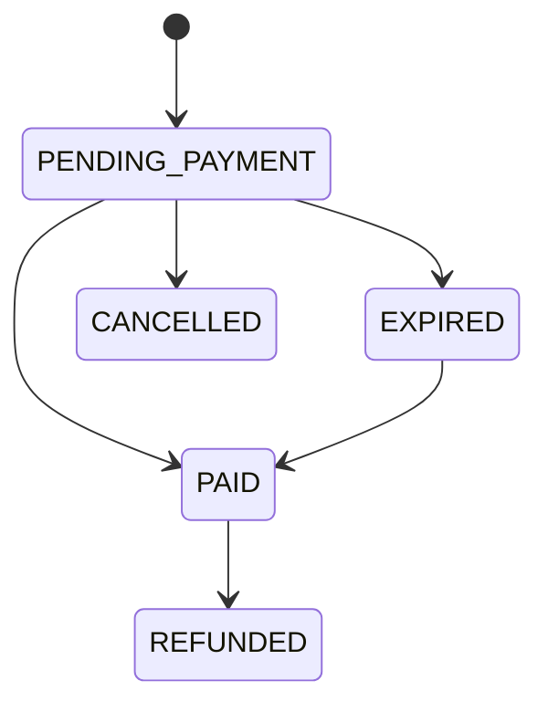
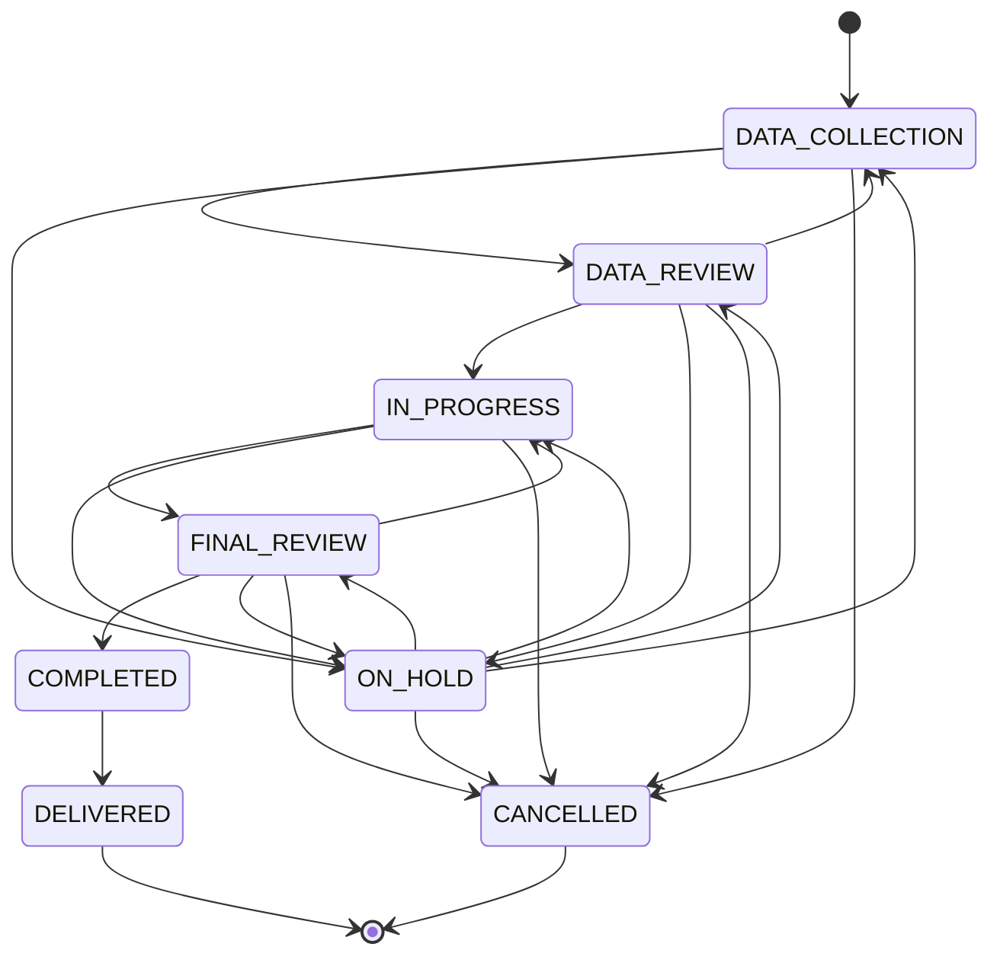
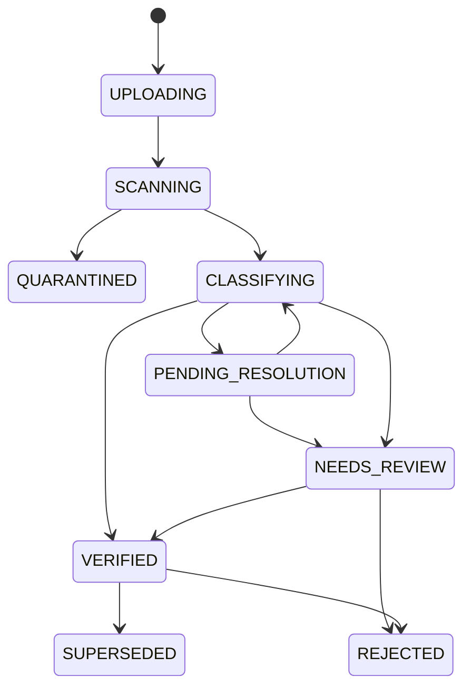

# State Machine

Setiap transisi dijalankan oleh satu service method (`transition(entity, to, ctx)`). Method ini memvalidasi transisi terhadap tabel di bawah, menulis audit, dan menulis outbox event dalam satu transaksi. Transisi yang tidak ada di tabel ditolak dengan error `INVALID_STATE_TRANSITION` (HTTP 409).

Optimistic locking: setiap entitas punya kolom `version`. Update memakai `WHERE id = ? AND version = ?`.

## 1. Order

| From | To | Actor | Trigger | Side effect |
|---|---|---|---|---|
| PENDING_PAYMENT | PAID | system:webhook | Payment PAID terverifikasi | Buat project, notif PAYMENT_RECEIVED |
| PENDING_PAYMENT | EXPIRED | system:scheduler | `expires_at` lewat | Expire payment aktif di gateway |
| PENDING_PAYMENT | CANCELLED | Client | Batal sebelum bayar | Batalkan payment aktif |
| EXPIRED | PAID | system:webhook | Pembayaran terlambat tetapi valid (EC-02) | Buat project, alert Admin |
| PAID | REFUNDED | Super Admin | Refund tercatat | Project CANCELLED jika belum DELIVERED |

Invalid: PAID -> PENDING_PAYMENT, REFUNDED -> apa pun, CANCELLED -> PAID (dana masuk setelah batal ditangani EC-02 via alert, bukan transisi otomatis).

## 2. Payment

| From | To | Actor | Trigger |
|---|---|---|---|
| PENDING | PROCESSING | system:webhook | Gateway melaporkan proses |
| PENDING, PROCESSING | PAID | system:webhook, system:reconcile | Status lunas terverifikasi |
| PENDING, PROCESSING | FAILED | system:webhook | Gateway gagal |
| PENDING, PROCESSING | EXPIRED | system:webhook, system:scheduler | Batas waktu habis |
| EXPIRED, FAILED | PAID | system:webhook | Pelunasan valid terlambat (EC-02) |
| PAID | REFUNDED | Super Admin | Refund tercatat |

Guard urutan: event dengan `occurred_at` lebih lama dari `last_provider_event_at` tidak menurunkan status. PAID hanya dapat berubah ke REFUNDED.

## 3. Project

| From | To | Actor | Trigger | Side effect |
|---|---|---|---|---|
| (none) | DATA_COLLECTION | system:workflow | `payment.confirmed` | Instansiasi workflow, assign primary admin, notif Client |
| DATA_COLLECTION | DATA_REVIEW | system:workflow | Semua task DATA_SUBMISSION selesai | Task validasi untuk Admin |
| DATA_REVIEW | DATA_COLLECTION | Admin | `data.rejected` dengan daftar item | Reopen task terkait, notif Client |
| DATA_REVIEW | IN_PROGRESS | Admin | `data.validated` | Start Project Clock, usulan Notary |
| IN_PROGRESS | FINAL_REVIEW | system:workflow | Stage REGISTRATION selesai | Task Final QA |
| FINAL_REVIEW | IN_PROGRESS | Admin | `final_qa.rejected` | Reopen task Notary terkait |
| FINAL_REVIEW | COMPLETED | Admin | `final_qa.approved` | Stop Project Clock, enqueue delivery |
| COMPLETED | DELIVERED | system:delivery | Minimal satu channel delivery SENT atau DELIVERED | Notif PROJECT_COMPLETED ke internal |
| Aktif | ON_HOLD | Admin, Super Admin | Hold dengan alasan | Simpan `previous_status`, pause clock |
| ON_HOLD | previous_status | Admin, Super Admin | Resume | Resume clock |
| Aktif, ON_HOLD | CANCELLED | Super Admin, system:refund | Cancel dengan alasan atau refund | Cancel task terbuka, tutup eskalasi |

Aktif = DATA_COLLECTION, DATA_REVIEW, IN_PROGRESS, FINAL_REVIEW.

Invalid (contoh): DATA_COLLECTION -> IN_PROGRESS, IN_PROGRESS -> COMPLETED, COMPLETED -> IN_PROGRESS, DELIVERED -> apa pun, CANCELLED -> apa pun, ON_HOLD -> status selain `previous_status`.

Override Super Admin: dapat memaksa transisi di luar tabel dengan alasan wajib. Override tercatat `STATUS_OVERRIDDEN` dan memicu review konsistensi workflow (task tidak berubah otomatis).

Guard integritas yang tetap berlaku untuk override (hasil CONSISTENCY_AUDIT.md, CA-07):

| Guard | Alasan |
|---|---|
| Target COMPLETED hanya jika `final_qa.approved` tercatat | BR-DOC-003, gerbang manusia dokumen legal |
| Target DELIVERED tidak pernah melalui override | Hanya `system:delivery` dengan bukti channel |
| Asal DELIVERED atau CANCELLED tidak dapat di-override | BR-PROJECT-006, status terminal |
| Pelanggaran guard menghasilkan 409 `INVALID_STATE_TRANSITION` | FR-PROJECT-010, TC-040 |

## 4. Task

| From | To | Actor | Trigger |
|---|---|---|---|
| BLOCKED | OPEN | system:workflow | Semua dependency selesai |
| OPEN | IN_PROGRESS | Owner | Aksi pertama (upload, isi form, klik mulai) |
| OPEN, IN_PROGRESS | NEEDS_REVIEW | system:document | Evidence masuk tetapi butuh review |
| OPEN, IN_PROGRESS | COMPLETED | system:workflow, owner | Evidence VERIFIED, event cocok, atau konfirmasi MANUAL |
| NEEDS_REVIEW | COMPLETED | Admin | Dokumen diverifikasi |
| NEEDS_REVIEW | OPEN | Admin | Dokumen ditolak |
| COMPLETED | OPEN | Admin, system:workflow | Reopen (revisi, QA ditolak) |
| BLOCKED, OPEN | SKIPPED | system:workflow | Kondisi task tidak berlaku |
| Non-final | CANCELLED | system:workflow | Project CANCELLED |

## 5. Document

| From | To | Actor | Trigger |
|---|---|---|---|
| UPLOADING | SCANNING | API | Upload complete, hash dan ukuran cocok |
| SCANNING | QUARANTINED | system:document | Malware terdeteksi |
| SCANNING | CLASSIFYING | system:document | Scan bersih |
| CLASSIFYING | PENDING_RESOLUTION | system:document | Project belum terselesaikan (WhatsApp) |
| PENDING_RESOLUTION | CLASSIFYING | system:wa, Admin | Project terselesaikan |
| PENDING_RESOLUTION | NEEDS_REVIEW | system:scheduler | Batas waktu resolusi habis |
| CLASSIFYING | VERIFIED | system:document | Semua syarat auto-verify terpenuhi |
| CLASSIFYING | NEEDS_REVIEW | system:document | Ada syarat tidak terpenuhi |
| NEEDS_REVIEW | VERIFIED | Admin, Super Admin | Review setuju |
| NEEDS_REVIEW | REJECTED | Admin, Super Admin | Review tolak dengan alasan |
| VERIFIED | SUPERSEDED | system:document | Versi baru VERIFIED |
| VERIFIED | REJECTED | Admin | Kesalahan ditemukan setelah verifikasi, task reopen |

Upload yang tidak selesai dalam 1 jam dihapus oleh job cleanup dan tidak memiliki status akhir.

## 6. Escalation

| From | To | Actor | Trigger |
|---|---|---|---|
| (none) | OPEN | system:sla, Admin | Aturan eskalasi terpenuhi atau manual |
| OPEN | ACKNOWLEDGED | Penerima | Klik acknowledge |
| OPEN, ACKNOWLEDGED | RESOLVED | Penerima, Super Admin | Resolusi dengan catatan |
| OPEN, ACKNOWLEDGED | AUTO_RESOLVED | system:sla | Kondisi pemicu hilang |

## 7. Delivery

| From | To | Trigger |
|---|---|---|
| QUEUED | SENT | Provider menerima pesan |
| SENT | DELIVERED | Status delivered dari provider |
| DELIVERED | READ | Status read dari provider atau Client membuka link |
| QUEUED, SENT | FAILED | Error provider atau timeout |
| FAILED | QUEUED | Retry atau fallback channel |
