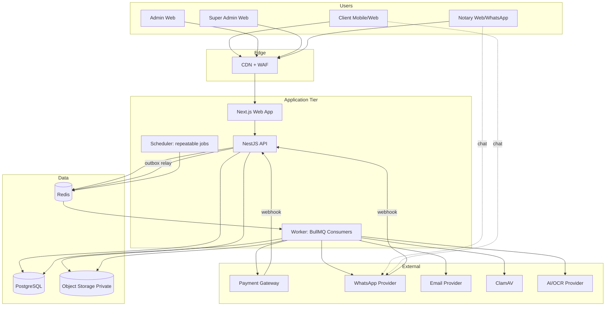
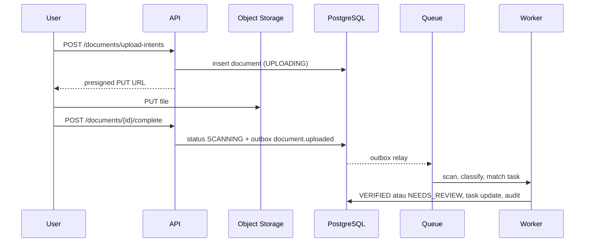

# System Architecture

## 1. Opsi Arsitektur

### Option A (Recommended): Modular Monolith TypeScript

| Layer | Teknologi |
|---|---|
| Frontend | Next.js (App Router), React, Tailwind CSS |
| API | NestJS (REST, OpenAPI) |
| Worker | Proses Node.js terpisah dari codebase yang sama, BullMQ |
| Database | PostgreSQL 16 |
| ORM dan migrasi | Drizzle ORM, migrasi SQL |
| Queue dan cache | Redis |
| Storage | S3-compatible object storage, bucket privat |
| Malware scan | ClamAV sebagai container |
| Validasi skema | Zod di `packages/shared` |
| Monorepo | pnpm workspace dan Turborepo |

### Option B (Alternative): Laravel Monolith

Laravel, Inertia.js atau Livewire, Laravel Horizon, PostgreSQL, Redis, S3.

### Option C (Ditolak): Microservices dan Kubernetes

Ditolak untuk MVP. Domain belum stabil. Biaya operasional dan kompleksitas tinggi.

### Trade-offs

| Kriteria | Option A | Option B |
|---|---|---|
| Cost | Rendah. 3 container dan managed services. | Rendah. |
| Complexity | Sedang. Dua framework (Next.js dan NestJS). | Rendah. Satu framework. |
| Scalability | Worker dan API skala terpisah. | Horizon skala worker. Cukup untuk MVP. |
| Development speed | Tinggi dengan tipe bersama. | Tinggi untuk CRUD. |
| Maintainability | Tipe end-to-end menekan bug kontrak. | Baik. Tipe frontend terpisah. |
| Security | Ekosistem matang. Perlu konfigurasi CSRF manual. | Proteksi CSRF dan session bawaan. |
| AI integration | SDK AI paling lengkap di ekosistem TypeScript dan Python. | SDK tersedia. Pilihan lebih sedikit. |
| WhatsApp integration | Setara. Via HTTP API provider. | Setara. |
| File storage | SDK S3 matang. | Flysystem matang. |
| Konteks Indonesia | Talenta TypeScript tersedia luas. | Talenta Laravel sangat luas di Indonesia. |
| AI coding agent | Kinerja agent sangat baik pada TypeScript bertipe ketat. | Baik. |

### Proposed Baseline Architecture

**Option A.** Alasan penentu: kontrak tipe tunggal antara frontend, API, worker, dan AI coding agent. Kontrak ini menekan bug integrasi pada sistem yang sangat bergantung pada status dan event. Option B tetap valid jika tim yang tersedia berbasis PHP (`REQUIRES BUSINESS DECISION`).

## 2. Architecture Diagram



## 3. Module Boundaries

Setiap modul memiliki folder sendiri di `apps/api/src/modules/<module>`. Modul lain hanya mengakses modul melalui service publik atau event. Akses tabel lintas modul dilarang kecuali lewat read model.

```text
apps/
  web/            Next.js, semua role, route group per role
  api/            NestJS REST API dan webhook receiver
  worker/         Consumer queue dan scheduler
packages/
  shared/         Enum kanonik, Zod schema, tipe event
  db/             Skema Drizzle dan migrasi
  providers/      Implementasi interface provider
  ui/             Komponen design system
```

## 4. Request Flow: Upload Dokumen



## 5. Prinsip Teknis

1. Database adalah sumber status. Queue hanya transport.
2. Setiap perubahan status dan event outbox ditulis dalam satu transaksi.
3. Setiap consumer idempotent terhadap `event_id`.
4. Setiap integrasi eksternal melewati interface di `packages/providers`.
5. Tidak ada logika bisnis di frontend. Frontend membaca status dari API.
