# User Flows

## 1. Overall Business Process

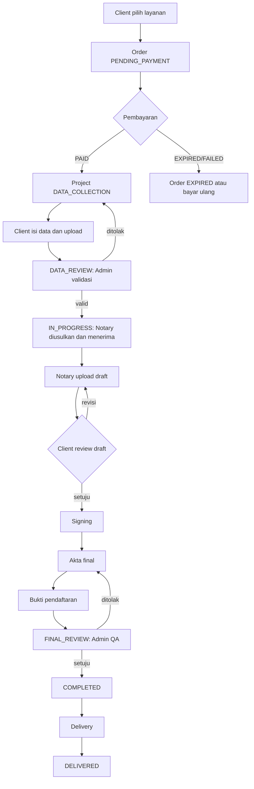

## 2. Client Flow

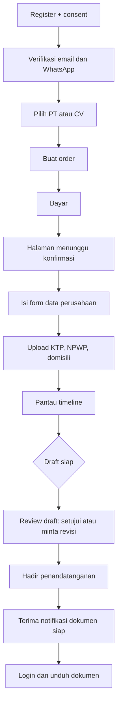

## 3. Admin Flow

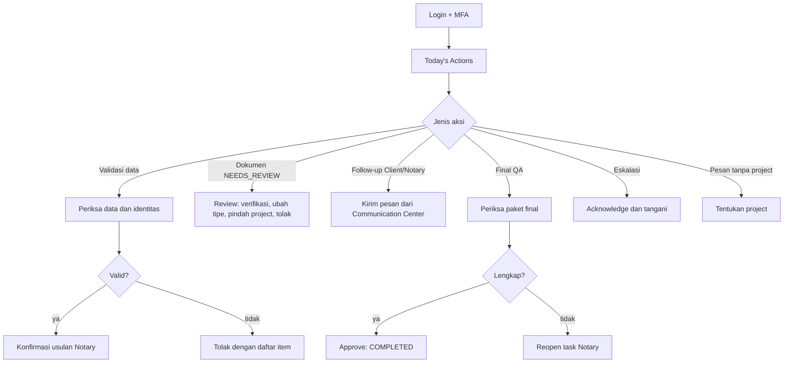

## 4. Notary Flow

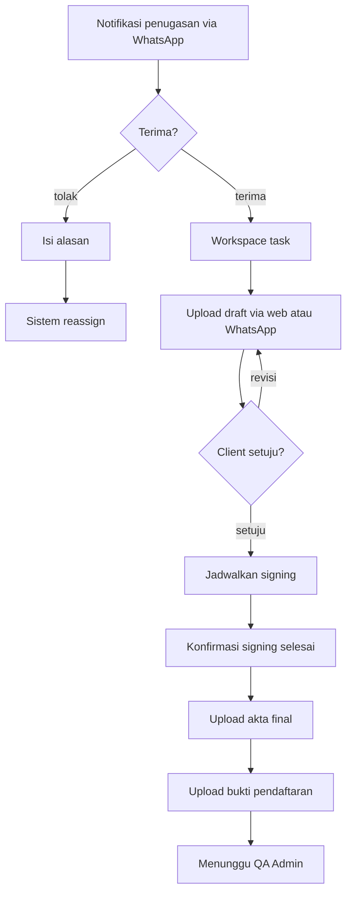

## 5. Super Admin Flow

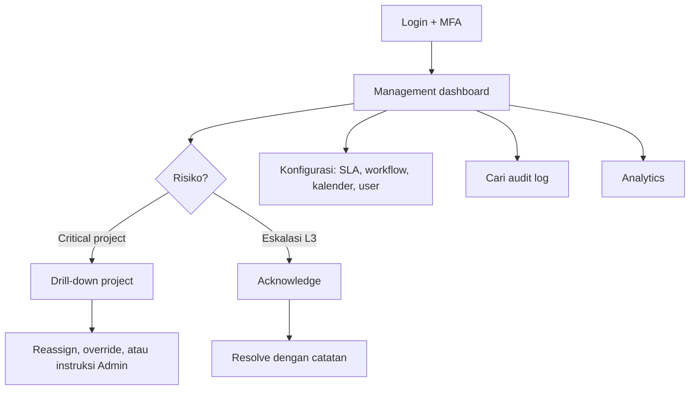

## 6. Payment Flow

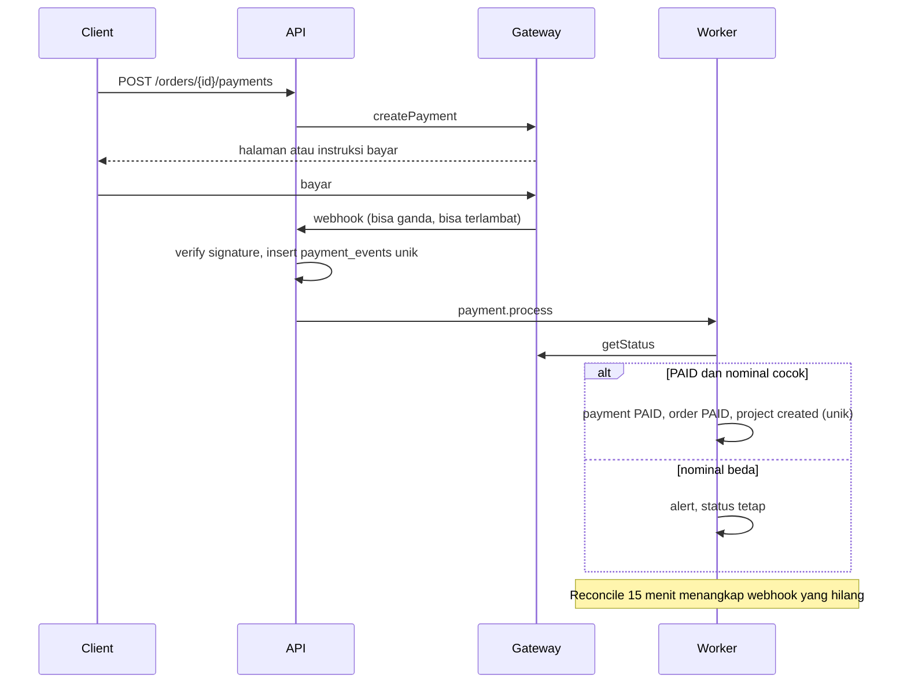

## 7. Document Flow

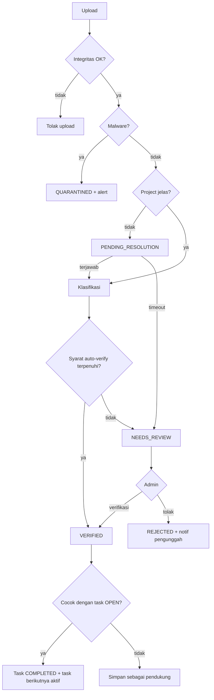

## 8. WhatsApp Flow

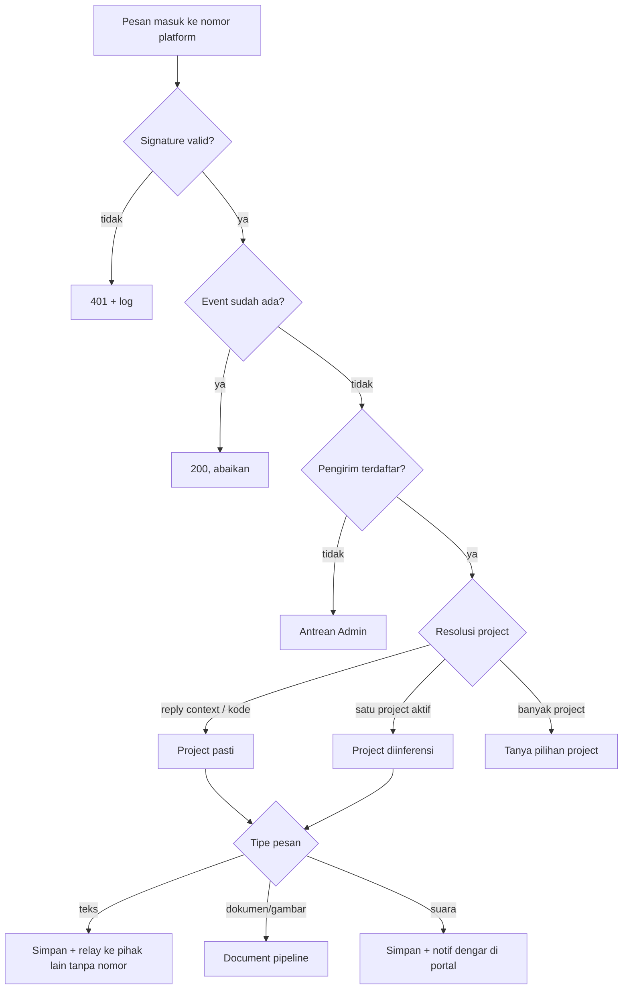

## 9. SLA Flow

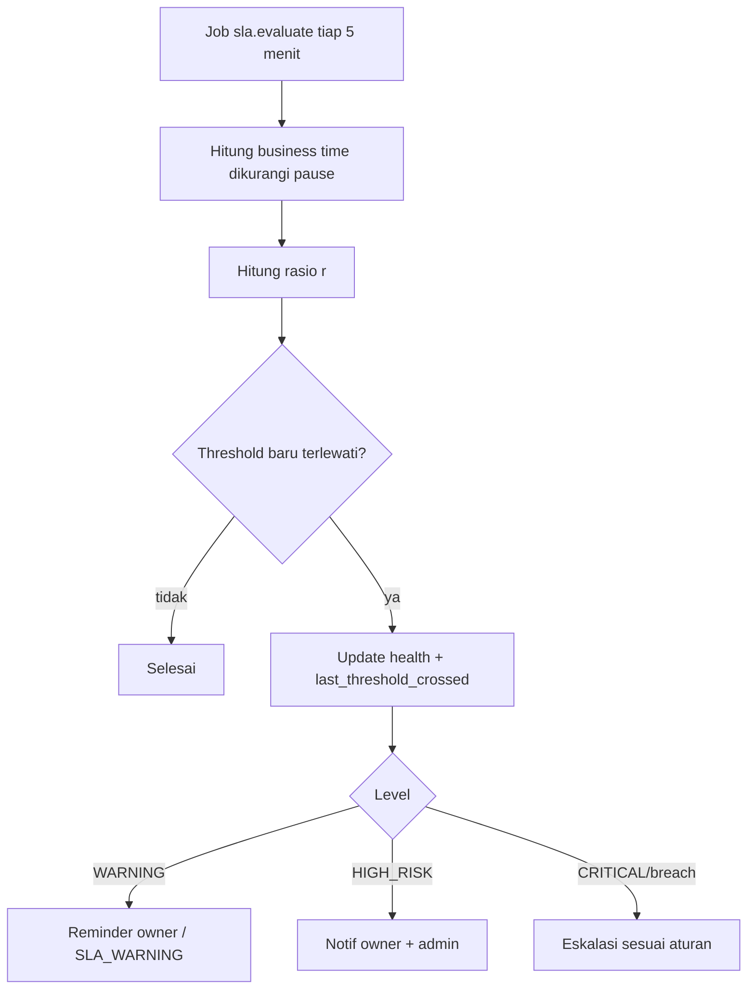

## 10. Escalation Flow

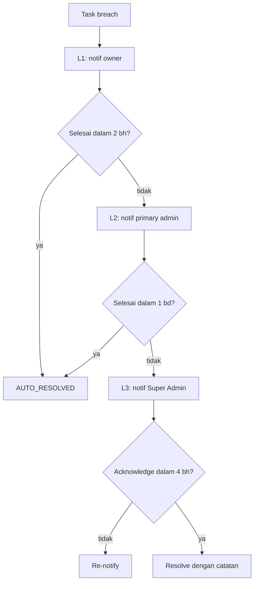

## 11. Final Document Delivery

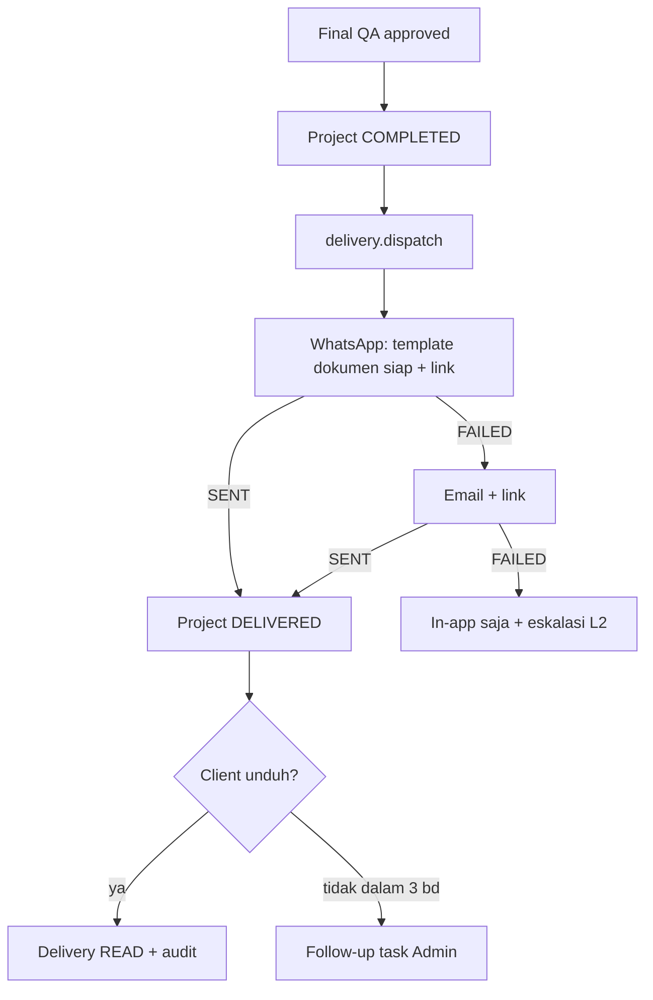

## 12. Error dan Fallback Flow

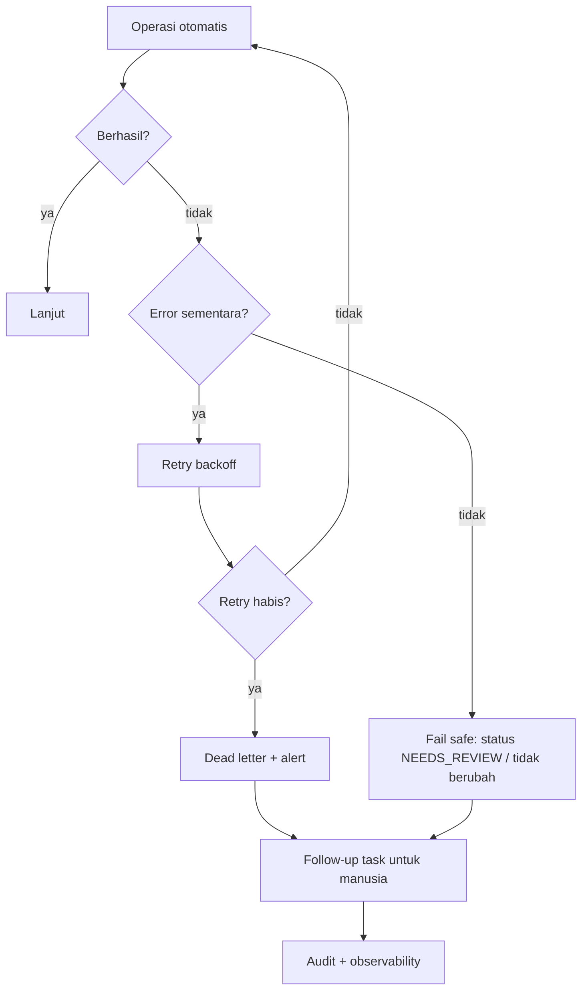
