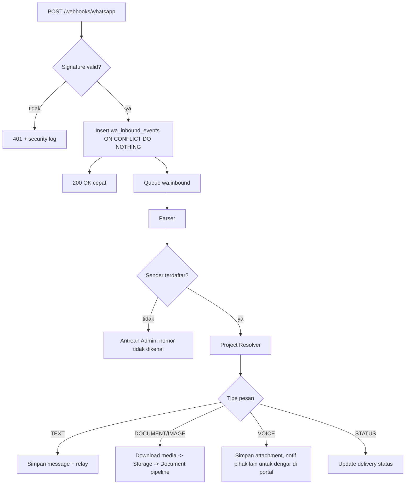

# WhatsApp Integration

## 1. Pilihan Integrasi

| Opsi | Status |
|---|---|
| WhatsApp Business Platform (Cloud API langsung atau via Business Solution Provider) | Direkomendasikan |
| Library tidak resmi berbasis WhatsApp Web | Ditolak. Risiko pemblokiran nomor dan pelanggaran ketentuan layanan. |

`TECHNICAL_VALIDATION_REQUIRED`: pilihan provider, biaya per percakapan, proses verifikasi bisnis, dan batas pengiriman. Dokumen ini tidak mengasumsikan fitur provider tertentu di luar interface.

## 2. Model Proxy

```text
CLIENT  <-> WhatsApp <-> Nomor Platform <-> PLATFORM <-> Nomor Platform <-> WhatsApp <-> NOTARY
```

- Satu nomor bisnis platform (ASSUMPTION A-010).
- Client dan Notary hanya berbicara dengan nomor platform.
- Platform menyimpan pesan di conversation `PROJECT_EXTERNAL`, lalu meneruskan teks ke pihak lain.
- Nomor telepon tidak pernah diteruskan (BR-WA-001).

Format pesan relay:

```text
[PRJ-2026-000001] Notaris:
Draft akta sudah kami kirim. Mohon dicek di portal.
Balas pesan ini untuk menjawab.
```

## 3. Provider Interface

```ts
interface WhatsAppProvider {
  sendText(to: E164, body: string, ctx: SendContext): Promise<SendResult>;
  sendTemplate(to: E164, templateCode: string, params: string[], ctx: SendContext): Promise<SendResult>;
  downloadMedia(mediaRef: string): Promise<{ stream: Readable; mimeType: string; size: number }>;
  verifyWebhook(headers: Record<string, string>, rawBody: Buffer): boolean;
  parseWebhook(rawBody: Buffer): WaInboundEvent[];   // pesan dan status delivery
  isWithinServiceWindow(to: E164): Promise<boolean>;
}
```

`SendResult` berisi `provider_message_id`. Semua pengiriman melewati queue `wa.outbound`.

## 4. Inbound Pipeline



Webhook handler hanya memverifikasi, menyimpan, dan mengembalikan 200. Semua proses lain berjalan asinkron.

## 5. Sender Identification

1. Normalisasi nomor ke E.164.
2. Cari `users.phone_e164` dengan `phone_verified_at` tidak null.
3. Nomor tidak dikenal: pesan disimpan di `unmatched_messages`, balasan otomatis generik, follow-up task untuk Admin.

## 6. Project Resolution Algorithm

| Langkah | Metode | Kode | Keyakinan |
|---|---|---|---|
| 1 | Pesan adalah balasan (reply context) ke pesan platform yang terikat project | `REPLY_CONTEXT` | Tinggi |
| 2 | Teks atau caption memuat kode `PRJ-YYYY-NNNNNN` milik sender | `EXPLICIT_CODE` | Tinggi |
| 3 | Sender memiliki tepat satu project aktif | `SINGLE_ACTIVE` | Sedang |
| 4 | Sender memiliki lebih dari satu project aktif | `ASK_USER` | Tidak ada |

Langkah 4: platform membalas dengan daftar project aktif (kode dan nama perusahaan) dan meminta sender memilih. Lampiran disimpan sebagai PENDING_RESOLUTION. Tidak ada jawaban dalam 4 business hours: dokumen menjadi NEEDS_REVIEW dan masuk antrean Admin.

`SINGLE_ACTIVE` tidak memenuhi syarat auto-verify untuk dokumen legal-critical. Dokumen tersebut menjadi NEEDS_REVIEW dengan alasan `PROJECT_INFERRED`.

Kode project harus milik sender. Kode project lain yang dikirim sender dianggap tidak valid dan dicatat sebagai `SECURITY_SUSPICIOUS_REFERENCE`.

Setiap pesan keluar dari platform menyimpan pemetaan `provider_message_id -> project_id` agar langkah 1 bekerja.

## 7. Outbound

| Kasus | Metode |
|---|---|
| Dalam jendela layanan provider | `sendText` |
| Di luar jendela (pesan inisiatif bisnis) | `sendTemplate` dengan template terdaftar (BR-WA-004) |

Template minimal (nama internal, isi final butuh persetujuan provider):

| Kode | Kegunaan |
|---|---|
| `wa_otp_verification` | Verifikasi nomor |
| `wa_task_reminder` | Reminder task Client atau Notary |
| `wa_new_message` | Ada pesan baru di project {kode} |
| `wa_document_ready` | Dokumen final siap diunduh |
| `wa_payment_received` | Konfirmasi pembayaran |
| `wa_escalation_internal` | Eskalasi ke internal |

`TECHNICAL_VALIDATION_REQUIRED`: apakah relay teks bebas di luar jendela layanan dapat dikirim sebagai parameter template. Jika tidak, penerima menerima `wa_new_message` dan membaca pesan di portal.

## 8. Media

- Media diunduh ke storage segera setelah webhook diproses, karena referensi media provider dapat kedaluwarsa (TECHNICAL_VALIDATION_REQUIRED).
- Lampiran tidak pernah diteruskan mentah ke pihak lain (BR-WA-003).
- Penerima mendapat notifikasi "Dokumen baru: {tipe} di project {kode}" dengan link portal.

## 9. Keandalan

| Aspek | Kontrol |
|---|---|
| Autentikasi webhook | Verifikasi signature HMAC sesuai provider, raw body, perbandingan constant-time |
| Idempotency | Unique `(provider, provider_message_id)` di `wa_inbound_events` |
| Out of order | Status delivery hanya naik (QUEUED < SENT < DELIVERED < READ). FAILED dicatat terpisah. |
| Retry outbound | 5 kali, backoff eksponensial 30 detik sampai 30 menit |
| Rate limit | Limiter token bucket per nomor platform di worker. Nilai TBD dari provider. |
| Provider down | Circuit breaker. Notifikasi pindah ke email dan in-app. Pesan relay ditahan dan dikirim ulang saat pulih. |
| Replay attack | Tolak event dengan timestamp lebih dari 10 menit jika provider menyediakan timestamp tertandatangani |

## 10. Consent

- Client mencentang persetujuan menerima pesan WhatsApp saat registrasi (`wa_opt_in_at`).
- Notary menyetujui saat aktivasi akun.
- Pesan "STOP" menonaktifkan notifikasi WhatsApp non-transaksional. `LEGAL_REVIEW_REQUIRED` untuk definisi pesan transaksional.
